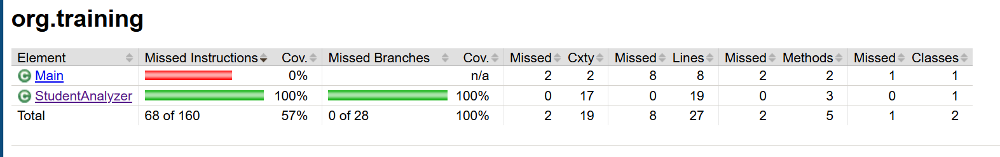

# Unit Test - StudentAnalyzer

## Mô tả bài toán

Bài tập gồm lớp `StudentAnalyzer` với hai phương thức:

- `countExcellentStudents(List<Double> scores)`:  
  Đếm số học sinh đạt loại Giỏi (điểm >= 8.0).  
  Bỏ qua điểm không hợp lệ (âm hoặc > 10).  
  Nếu danh sách rỗng hoặc null, trả về 0.

- `calculateValidAverage(List<Double> scores)`:  
  Tính điểm trung bình hợp lệ (từ 0 đến 10).  
  Bỏ qua điểm không hợp lệ hoặc null.  
  Nếu không có điểm hợp lệ, trả về 0.

## Yêu cầu kỹ thuật

- Bỏ qua các điểm < 0 hoặc > 10.
- Nếu danh sách rỗng hoặc null, trả về 0.
- Duyệt danh sách để đếm học sinh giỏi và tính điểm trung bình hợp lệ.

## Yêu cầu kiểm thử

- Test với danh sách có điểm hợp lệ và không hợp lệ.
- Test danh sách toàn hợp lệ.
- Test danh sách rỗng.
- Test danh sách chứa giá trị biên (0 và 10).
- Test trường hợp có điểm < 0 hoặc > 10.

## Độ phủ mã


## Cấu trúc thư mục

- `src/`: chứa mã nguồn Java
- `test/`: chứa mã kiểm thử JUnit

## cov


## Hướng dẫn chạy

1. Clone repo về máy:

```bash
git clone https://github.com/phungvanvu/unit-test-PhungVanVu.git
